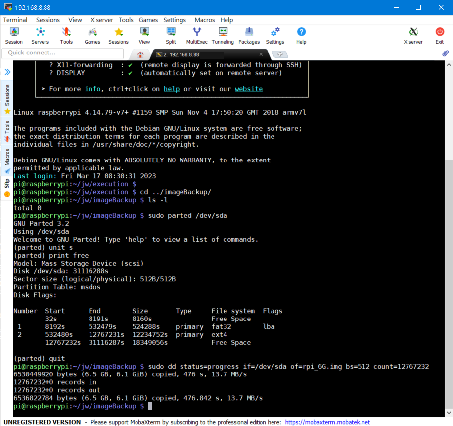

# Rasberry_Pi_Backup_Restore
Backup and restore of Raspberry Pi system SD card

## 說明與準備
這是一份備份 raspberry pi sysytem 用資料量大小來建立 image 檔案，優點: image 檔案比整張 SD card 複製檔案小很多。

起因是因為整個 SD card 備份會占用大量磁碟空間，雖然還原後需要調整 SD card 空間。

這個方法是在 Pi or linux 系統上，把 Pi system SD card 用 dd 進行備份的方法，

需要讀卡機，將 Pi sd card 放入讀卡機後進行備份。

需要一個可以運作的 Pi or linux 系統，我是用 pi (running ; 32G)備份在另一個 SD card(6G 資料大小)上的 Pi System。

## 需要安裝的套件
安裝 dd 的 progress
```
sudo apt install progress
```

安裝 GParted
```
sudo apt install gparted
```

## 備份
先進入到 Pi Desktop 系統，將要備份的 SD card 插上，在 Preferences 找到 Gparted 這個工具(需要輸入 root password)，

如果 SD card 被 mount 的情況，可以看到 Partition 上有一把鎖的圖示，這時候可以對著 Partition 點右鍵選擇 umount。

解鎖後就可以在 Partition 上點選滑鼠右鍵，可以看到有 Resize/Move 的選項，調整要保留的空間大小。

保留空間大小：基本上是資料大小 + 資料大小* 20% 左右。

調整完成後將 Gparted and 檔案總管之類的軟體關閉。

打開 command windows: (也可以用 SSH 從遠端登入操作)

查看 SD card 大小與磁區數字
```
sudo parted /dev/sda
```

進入 parted 後輸入以下指令
```
unit s
print free
```

這時候會列出 /dev/sda 的資訊:

查看 ext4 結尾 and Free Space 開頭的數字，然後以 Free Space 開頭的數字做為 dd 需要備份的空間大小。
```
sudo dd status=progress if=/dev/sda of=rpi_6G.img bs=512 count=12767232
```

status: 顯示備份進度(需要安裝套件)
if: 是要備份的 /dev/sd?
of: image file name
bs: 512 or 4M
count: 就是 Free Space 開頭的數字

以上就是備份 Pi System SD card 的方法，跑完後就可以看到 rpi.img 。

記得運作指令的 Pi 系統可用空間要比備份的 SD Card 備份大小還要大才可以。

## 還原
在 windows 環境下可以用附加的 image.7z 內的 imageUSB.exe 還原。

在 linux or Pi 環境下可以用下列指令還原:
```
sudo dd status=progress if=rpi_6G.img of=/dev/sda
```

## Example


## References
[Ref.1](https://blog.csdn.net/zhufu86/article/details/109962309)

[Ref.2](https://blog.cavedu.com/2018/03/22/raspberry-pi-sd-card/)
